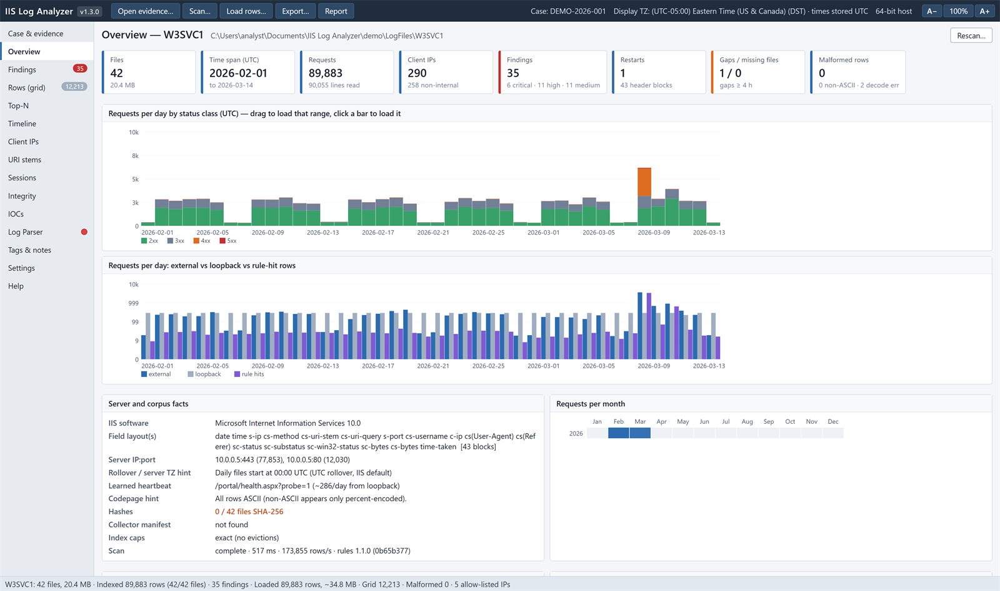
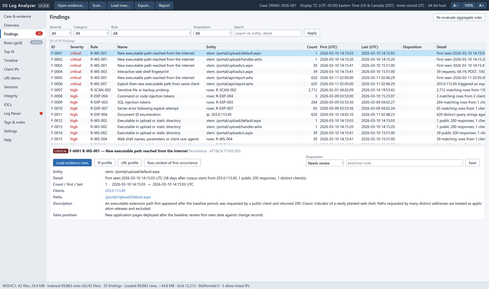

# IIS Log Analyzer (HTA)

Offline analysis of Microsoft IIS W3C Extended logs for digital forensics and incident response. It runs as an HTML Application in `mshta.exe` with no installer, no network access and nothing beyond what ships with Windows 10/11. The full user manual is [docs/manual.html](docs/manual.html) (download the repository and open it in a browser).





The screenshots use the synthetic demo data from `tools\make-demo-logs.js` (documentation IP ranges, fictitious server); no real evidence is included in this repository.

## Start

```bash
mshta.exe "<folder>\IISLogAnalyzer.hta"
```

Double-clicking `IISLogAnalyzer.hta` works too. An evidence path can be passed as the first argument and the tool will offer to open it.

- If the file came from another machine, unblock it first (Properties > Unblock, or `Unblock-File`).
- AppLocker/WDAC or Defender ASR policies sometimes block `mshta.exe`. The tool cannot work around that; ask for an exception on the analysis workstation.
- Double-clicking an `.hta` starts the 32-bit `SysWOW64\mshta.exe` on most systems. The app detects this and relaunches itself in the 64-bit host automatically (add `/no64` to stay in 32-bit, which has smaller row caps). The toolbar shows the host bitness.
- Text size follows the Windows display scaling automatically (mshta itself renders at 100%). Use **A−** / **A+** in the toolbar, Ctrl+= / Ctrl+-, or Ctrl+mouse wheel to adjust; click the percentage or press Ctrl+0 to reset. The choice is remembered.

`dist\IISLogAnalyzer.hta` is a single-file build of the same application, including the fast engine sources (produced by `build.ps1`), for copying to another workstation. The folder layout is the editable form.

## Workflow

1. **Case & evidence.** Open or create a case. The workspace is `<workspace root>\<CaseID>\IIS-Log-Analyzer\` (default root `%USERPROFILE%\Documents\IIS Log Analyzer Cases`, set in Settings). Choose the display time zone for the case. Open the evidence folder: a `LogFiles` folder, a `W3SVCn` folder, or a single `.log` file. Velociraptor collections are recognised automatically; original paths (`C:\inetpub\...`) are shown alongside the `C%3A` on-disk paths.
2. **Scan.** Streams every selected file once and builds the index: per-day/hour counts, per-client, per-path and per-user-agent aggregates, first-seen tables, restarts, gaps and rule hits. Rows are not kept in memory. Choose the fast or the built-in engine (see below). Scans can be cancelled and continued. The index is cached in the case workspace and reloaded automatically if the evidence is unchanged; a changed file blocks the cached index and is reported.
3. **Overview and Findings.** Review the corpus, then findings by severity. Record a disposition (true positive, false positive, benign) and a note for each.
4. **Load rows.** Choose a date range and/or a pre-filter (for example `class:public`) to load a slice into the grid. Opened from a chart, the dialog takes the selected time range and narrows the file selection to the files that cover it. The load stops at the row cap; nothing is sampled.
5. **Investigate.** Grid with quick filters, pivots (right-click), raw context straight from the evidence file (Enter / double-click), Top-N, Timeline, IP and URI profiles, Sessions, and free-form SQL through Log Parser 2.2 when it is installed.
6. **Tag, note, export, report.** Every export and report is hashed (`.sha256` sidecar) and recorded in `audit.log`.

## Scan engines

| Engine | How it runs | When to use |
|---|---|---|
| Fast (default when available) | `engine\IISScanEngine.cs`, compiled on first use by Windows PowerShell 5.1 `Add-Type` and cached in `%LOCALAPPDATA%\IISLogAnalyzer\engine`, runs hidden out of process with two threads | Large corpora |
| Built-in | JavaScript inside the HTA window | When PowerShell is blocked by policy, or to continue a cancelled scan |

- Both engines produce the same index. The HTA hands the fast engine its own rules, lists, regular-expression sources, parser tables and time-zone table, and both engines finish through the same JavaScript post-processing. `test\compare-engines.js` checks every index value and every finding across both engines. It reports identical results on a 16.7 GB, 67-million-row production corpus.
- If the fast engine cannot start, the app offers to rerun the scan with the built-in engine. A watchdog ends the wait if the engine process dies without finishing, never starts, stops making progress, or ignores a cancel.
- Cancelling either engine saves the detection state at that point (per-client time windows, exploit windows, eviction and continuity counters) in the partial index. "Continue scan" resumes with the built-in engine and produces exactly the index and findings of an uninterrupted scan. A scan can only be continued with the rules, enabled rules and business hours it started with.
- Nothing is installed: the engine source ships with the tool, is compiled by the .NET Framework that comes with Windows, and only reads the evidence.

## Display time zones

- The display time zone is a Windows time zone (all 141 from the registry, with their historical "Dynamic DST" rules), UTC, or a fixed offset. It is set per case on the Case & evidence view; the default for new cases is in Settings.
- Local times, local-time filters (`after:`, `before:`, `hour:`, `dow:`), business hours for R-AUTH-004, Top-N by hour/day, Timeline Explorer exports and the report all use the offset in force at each instant, so DST changes are handled.
- Each zone's rules are compiled into a table of UTC transitions. A self-test against the Win32 conversion that Windows itself uses (`test\tz-oracle.ps1`, then `mshta IISLogAnalyzer.hta /tztest:<oracle>`) gave 0 mismatches in 58,884 checks across all zones from 1990 to 2035. .NET `TimeZoneInfo` reads a few historic year-boundary rules differently (Central Brazilian, Samoa, Volgograd, Turks and Caicos), so a .NET-based tool can differ by an hour at those instants.
- Stored times and the index are always UTC; changing the display zone never requires a rescan.

## Text decoding

Log files are read as Windows-1252, which maps every byte losslessly regardless of the machine's code page. Any line whose bytes form valid UTF-8 (IIS writes UTF-8 by default) is then decoded as UTF-8, so non-English paths display correctly (for example `/files/scans/年度報告.pdf`). Lines that are not valid UTF-8 keep their Windows-1252 reading. Both engines apply the same rule.

Files up to 32 MB are buffered whole while they are read, which is fastest. Larger files are streamed incrementally, so memory stays bounded whatever the file size; the threshold is "Stream files larger than (MB)" in Settings. Streaming is used only after a start-up self-test shows that it decodes all 256 byte values exactly like the buffered reader, which is the case on systems whose ANSI code page is 1252.

The raw line bundle export writes each selected line byte-for-byte as stored in the evidence file, whatever its encoding. A source line that did not end with CRLF is marked in the bundle.

## Updates

The version is shown next to the name in the top-left corner. Click it, or use **Check for updates...** on the Help page or in Settings, to ask GitHub (`api.github.com`) for the latest release; the check asks for confirmation and is audited. Automatic checks at start-up are off by default and can be enabled in Settings.

If a newer release exists, **Download and replace** fetches the new single-file HTA, verifies its size, its SHA-256 against the digest GitHub publishes for the release asset, and the version inside it, then replaces the running file, keeps the old one as `IISLogAnalyzer-<old version>.bak.hta`, and offers a restart. Nothing changes if a check fails. A copy running from the source folder gets the verified HTA in its Downloads folder instead.

## Log Parser 2.2 (optional)

If Microsoft Log Parser 2.2 is installed (default `Program Files (x86)\Log Parser 2.2`, or a path set in Settings), the **Log Parser** view runs SQL over the current scope. `{files}` in a query expands to the evidence files. Templates cover top clients, hourly volume, status breakdown, executable paths answered to non-internal clients, one client's requests, 5xx and slowest requests. Queries run hidden and asynchronously, results appear in the grid, can be exported with a hash, and every query is audited. The query text is passed through a query file, never on a command line. A traffic light on the tab (and a dot in the navigation) shows green when `LogParser.exe` is found, amber when the path set in Settings does not exist, and red when it is not installed. **Download Log Parser 2.2...** opens Microsoft's official download page in the browser after confirmation; the tool itself never downloads or installs Log Parser.

## Quick filter syntax

| Example | Meaning |
|---|---|
| `cip:203.0.113.45` `cip:10.0.0.0/8` `cip:/^203\./` | client IP (also matches the effective IP from X-Forwarded-For), CIDR, regex |
| `class:public` | IP class: public, rfc1918, internal, loopback, linklocal, cgnat, bogon, allowlisted |
| `method:POST` `method:invalid` | method, or any non-standard method |
| `status:4xx` `status:404.8` `status:500-599` | status class, status.substatus, range |
| `stem:login` `stem:*.aspx` `stem:=/exact` `stem:^/portal` `stem:/regex/` | URI stem contains / glob / exact / prefix / regex |
| `ext:.aspx,.php` `dir:/uploads/` `exec:yes` `static:no` `new:2026-09-01` | extension, directory prefix, executable/static, first seen on or after |
| `query:cmd=` `qlen:>500` `decerr:yes` | query contains, query length, URL-decode errors |
| `ua:python` `family:scanner` `ua:empty` | user agent contains, family, empty |
| `taken:>30000` `bytes:>1000000` | time-taken ms, sc-bytes |
| `after:2026-09-08` `before:"2026-09-08 12:00"` `hour:0-6` `dow:0,6` | time in the display time zone (append `Z` for UTC), local hour, weekday |
| `rule:any` `rule:R-EXP-*` `sev:high,critical` | rule hits; `sev:` uses the severity graded for that row |
| `tag:Attacker` `tag:none` `ioc:any` | tags and IOC matches |
| `file:u_ex2609*` `text:"phrase"` | source file, raw-line substring |
| `-field:value` | negate any term; bare words must all appear in the stem or query |

## Detection rules and lists

- `rules\default-rules.json` holds the 41 built-in rules (reconnaissance, exploitation, web shells, credential access, exfiltration, log integrity) with severity, ATT&CK IDs, descriptions and tunable `params`. Their logic lives in `lib\rules.js` and `lib\scan.js` (and, identically, in the fast engine); thresholds come from the JSON.
- Rules that match the request itself (R-WS-004 web shell names and parameters, R-EXP-001 to R-EXP-005 injection and probing) are graded by the response (`"gradeByStatus": true`): a hit keeps the rule severity when the server answered 2xx or 5xx, drops one level for 3xx, and drops to low for 4xx and other failures. Failed attempts are still counted. A finding takes the highest severity of its rows, and every row-rule finding lists its responses by status class.
- Rules can be enabled or disabled per case under Settings. Row-rule changes need a rescan. Aggregate-rule changes apply with "Re-evaluate aggregate rules" in Findings.
- Custom row rules are added to the JSON with a `match` block (see `C-EXAMPLE-001`). Supported keys: `method`, `stem`, `query`, `ua`, `user`, `raw` (each `{contains|glob|regex|equals}`), `status` (`404`, `4xx`, `404.8`), `ipClass`, `uaFamily`, `ext`, `cip` (CIDRs), `minTaken`, `exec`.
- `lists\*.txt` hold the sensitive paths, scanner user agents, executable and static extensions, login and download endpoints, known exploit paths, web shell names and parameters. One entry per line; `re:` prefix for a regex, `*`/`?` for a glob, otherwise a substring. Restart the HTA after editing.
- Allow-listed IPs (default `%USERPROFILE%\.hawk_triage_allowed_ips.txt`) are classed `allowlisted`: rows stay visible but public/internal rules do not fire for them.
- IOC lists accept `type,value,note` lines or bare values (IPs, CIDRs, `/paths`, `re:` regexes, free text). The Hawk IOC file can be imported from the IOCs view.

## Forensic handling

- Evidence is opened read-only by both engines. The tool refuses a case workspace inside the evidence folder and never writes there. Reading can update NTFS last-access times on volumes where that is enabled, so work from a copy or a mounted image as usual.
- SHA-256 of every evidence file is computed out of process (hidden PowerShell `Get-FileHash`) and compared with Velociraptor `uploads.json` sizes and `results\*.json` hashes where present. Re-hashing reports any file whose hash changed.
- All times are parsed and stored as UTC; the display time zone (case setting) is shown alongside. Dates and times are validated strictly: an impossible date such as `2026-02-31`, a 60th second or extra characters after the time make the row malformed (counted and sampled) instead of being shifted to a valid timestamp.
- Switching cases clears everything from the previous case (evidence, index, loaded rows, results), and switching sites clears the previous site's scope, rows and results. Background hashing or Log Parser results that arrive after a switch are discarded.
- A file that cannot be opened during a row load is never skipped silently. The load is marked incomplete, the files are listed on screen and in `audit.log`, and every export made from that load records them.
- The rule-set fingerprint covers the rule text and which rules are enabled. A cached index rebuilds its findings when the enabled rules have changed, and warns when a row rule enabled since the scan needs a rescan. Scans record the disabled rules in the audit log.
- Log fields are attacker-controlled. They are rendered only as text (never HTML), CSV cells starting with `= + - @` are prefixed with `'`, the HTML report escapes everything, and values such as `__proto__` or `constructor` are handled as ordinary keys.
- `audit.log` (JSON Lines) records case actions, evidence opened, scans (with engine and time zone), hashes, loads, every grid filter, tags, dispositions, Log Parser queries, exports and reports with output hashes. The report appendix reproduces it.
- The tool makes no network connections unless asked. The network actions are an optional reverse-DNS lookup for a single IP (behind an OPSEC warning), opening the Log Parser download page in the browser, and the update check and download from GitHub. Each asks for confirmation (the start-up update check runs only when enabled in Settings) and is audited.

## Workspace layout

```
<CaseID>\IIS-Log-Analyzer\
  case.json        case metadata, display time zone, tags, notes, bookmarks, dispositions, presets, columns, IOCs
  audit.log        JSON Lines audit trail
  index\           cached scan indexes (<site>-<fingerprint>.index.json)
  exports\         CSV / Timeline Explorer CSV / JSONL / raw bundles / Log Parser results / case bundle zip, each with .sha256
  reports\         self-contained HTML reports, each with .sha256
  tmp\             transient engine jobs, hashing and Log Parser scripts
```

## Keyboard

Ctrl+= / Ctrl+- / Ctrl+0 text size · Ctrl+F quick filter · Ctrl+L load rows · Ctrl+E export · Alt+1..9 views · arrows/PgUp/PgDn/Ctrl+Home/End in grids · Shift/Ctrl+click multi-select · Ctrl+C rows as TSV · Ctrl+Shift+C raw lines · Enter raw context · right-click pivot menu. F5 is disabled because it would discard loaded state.

## Testing

- `node test\run-scan.js <siteFolder> [fileRegex]` runs the built-in scan engine headless under Node with a small COM shim (`test\node-harness.js`) and prints corpus statistics and findings. `node test\run-load.js` exercises the load pass, filters, sorting, sessions and Top-N.
- `node test\compare-engines.js <siteFolder> [fileRegex]` runs both engines on the same files and compares every index value and finding (exit code 0 when identical). Set `PROFILE=1` for a timing breakdown of the fast engine.
- `node tools\make-demo-logs.js` writes 42 days of synthetic logs with a scripted intrusion to `demo\LogFiles\W3SVC1` (fictitious server, documentation IP ranges; turn on "treat documentation ranges as public" in Settings, or pass `--testnets` to the Node tools, before scanning it). `powershell -File tools\capture-screens.ps1` regenerates the manual's screenshots from it by rendering the app's own view snapshots in headless Edge.
- `node test\compare-resume.js <siteFolder> [fileRegex] [--points 0.13,0.5,0.91]` cancels each engine at those fractions of the rows, saves and reloads the partial index, resumes it with the built-in engine, and compares the result with an uninterrupted scan.
- `node test\regression-review.js` checks the fixes from the October 2026 peer review: rule wildcards, strict dates, the rule-set fingerprint, unreadable files during a load, eviction backoff and the fast-engine watchdog.
- `powershell -File test\run-autotest.ps1 -Root <siteFolder> [-Files <regex>] [-Load] [-Extra '<switches>']` runs the HTA itself in self-test mode inside `mshta.exe`: opens a test case, scans, optionally loads, renders every view and dialog, runs a markup-injection probe, writes a report and an export, then writes a JSON result. Extra switches on the HTA command line: `/engine:fast|builtin`, `/cancelafter:<ms>` (cancel and resume), `/hash`, `/noscan` (reload the cached index), `/lpstub:<path>` (Log Parser bridge with a stub), `/rawbundle` (export every loaded row as a raw bundle), `/streammb:<MB>` (streaming threshold for this run only), `/tz:<zone id>`, `/testnets`, `/trace`, `/shots`.
- `mshta IISLogAnalyzer.hta /updatetest /out:<result.json> [/updatefrom:<version> /updatereplace]` checks the latest release and, with `/updatereplace`, downloads, verifies and replaces that HTA file (run it on a copy).
- `powershell -File test\tz-oracle.ps1 [-Engine win32|dotnet]` builds a time-zone oracle; `mshta IISLogAnalyzer.hta /tztest:<oracle.json> /out:<result.json>` checks every zone against it.
- `test\fixtures\W3SVC9` is a hostile fixture: script markup in fields, a mid-file `#Fields` reorder, a short row, a backwards timestamp, a gap and a truncated last line. `test\fixtures\W3SVC10` covers encodings and dates: a BOM, UTF-8 and Chinese paths, invalid UTF-8, the five undefined Windows-1252 bytes, impossible dates, junk after the time, an LF-only line and a missing final newline. `test\fixtures\fake-logparser.cmd` stands in for `LogParser.exe` in the self-test.

## Measured performance (16.7 GB production corpus, 4,817 files, 64-bit mshta)

| Operation | Result |
|---|---|
| Full scan, 4,817 files, 16.7 GB, 67.4M rows, fast engine | 4.5 min (268 s engine time, 251k rows/s) |
| Full scan, same corpus, built-in engine | 19.8 min, peak 3.1 GB memory |
| Reopen with cached index (148 MB) | 5.1 s index load, 11.9 s including discovery |
| Load one 146 MB file (637k rows, raw kept) | 7.8 s streamed, peak 586 MB; 5.0 s buffered, peak 706 MB |
| Filter 637k rows by client | 57 ms |
| Sort 590k rows by time-taken | 0.36 s |
| SHA-256 of all 4,817 files (16.7 GB) | 33 s, all match the Velociraptor hashes |

## Known limitations

- The full corpus cannot be held in memory by an HTA. The index plus a pre-filtered load is the designed workflow; the row cap is enforced. Loading rows always uses the built-in engine.
- The Log Parser bridge has been tested with a stub, not with the real `LogParser.exe`, which is not installed on the build machine.
- Per-client tracking keeps the first 32 distinct paths and 8 user agents seen for each client; further ones are counted as overflow and shown with `+`. Load that client's rows for the complete picture.
- When a rule matches more than 25 clients, files or paths, the 25 strongest are separate findings and the rest are folded into one summary finding per rule.
- Rule-hit pointers are kept for the first 20,000 hits per rule (raw text for the first 200). Use `rule:<id>` as a load pre-filter to retrieve every hit. Index caps (IPs, stems, user agents) evict rare entries when reached and the Overview says so. Clients with rule hits, successful executable paths and frequent entries are never evicted, so a table can grow past its cap; the Overview then shows the counts, and further eviction attempts wait until the table has grown by another 10% of the cap.
- Window-based rules (rapid enumeration, login brute force, 401 bursts, enumeration of document IDs) use tumbling windows, not sliding ones.
- IIS binary (`.ibl`), ODBC, NCSA and IIS native formats are not parsed; Apache/nginx are out of scope.
